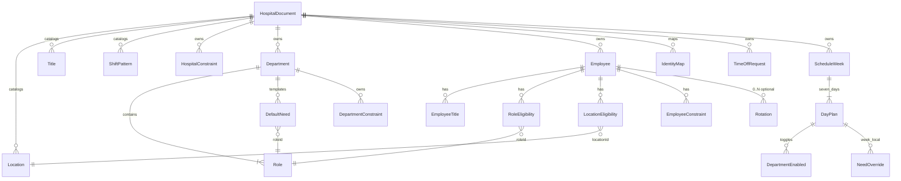

# OMS Domain Model + ERD Outline

*Track D working document. Schema shape reference: Approach B / v3, evolved to
v4 by removing redundant employee home-department data
(`docs/superpowers/specs/2026-08-03-oms-approach-b-schema-design.md`).
Fill the `[Tom]` sections; do not invent Postgres DDL here (that is SP5 / Track O —
physical target: `docs/superpowers/specs/2026-08-07-oms-modular-database-schema-design.md`).*

**Status:** Outline for completion — 2026-08-05  
**Rulings:** `docs/decisions/2026-08-05-track-d-rulings.md`

---

## 1. Purpose

Capture the **logical** model: entities, relationships, invariants, and what
“valid” means for a hospital schedule document. This is the seam Kasey consumes
for relational deepening (SP5). It is **not** the physical schema.

---

## 2. Ubiquitous language

| Term | Meaning (current) | [Tom] refine / correct |
|------|-------------------|------------------------|
| Roster | Set of employees eligible to be scheduled | |
| Pattern | Standing week template; represented as a sequence-1 rotation (§5 B) | |
| Rotation | Ordered week cycle for an employee (1..N), anchored to a Sunday; N=1 is standing week | |
| Toggle | (legacy) ON/OFF week for a cadence day — superseded by cell rotation rows in OMS | |
| Week Setup | Per-day DVM count, enabled departments, need overrides for one week | |
| Time Off / PTO | Requested absence; status PENDING/APPROVED/DENIED/HOLD | |
| Makeup Shift | | |
| Override | Manager cell edit on a proposed week | |
| Proposed Schedule | Generator output for a week before publish | |
| Coverage | Filled need slots vs required quantity | |
| Gap | Unfilled need | |
| Violation | Constraint breach (soft/hard by weight) | |
| Pull Order | Preference order when pulling Surgery/Dental → Room Tech | |
| Publish | Finalize week for distribution | |
| Department | Aggregate owning roles, default needs, dept constraints | |
| Role eligibility | Engine may place employee in that role; implies department authorization. Manager may place anyone. | |
| Need override | Week-local quantity/formula change; never mutates department defaults | |
| Schedule run | | |
| Location | Physical site an employee is scheduled at — LV (Linda Vista) or PB (Pacific Beach). The board shows one at a time (§6 I7) | |
| DVM count | Per-day **number** of DVMs a week needs; the permanent generation input. Not a list of names (§6 I9) | |
| Team assignment | Post-schedule step replacing generic DVM slots with named DVMs and pairing room techs to them. Out of scope for generation | |
| `ANY` cell | Rotation day with no constraint — employee available but not pinned to a role; generator may fill from eligibility. Spelled `ANY` or left blank (§5) | |

---

## 3. Aggregate roots (logical)

| Aggregate | Owns | Identity |
|-----------|------|----------|
| **HospitalDocument** | Catalogs + all hospital content | `version` (currently 3) |
| **Department** | `roles[]`, `defaultNeeds[]`, `constraints[]` | `id` / `code` |
| **Employee** | `titles[]`, `roleEligibilities[]`, `locationEligibilities[]`, `constraints[]`, `rotations[]` | `id` |
| **ScheduleWeek** | `dayPlans`, overrides, publish metadata | `weekStart` (Sunday) |

Cross-cutting (top-level, not nested under employee): `identityMaps[]`,
`timeOffRequests[]`, `hospitalConstraints[]`, `dvmDays[]`, `scheduleRuns`.

**[Tom] Confirm aggregates / boundaries:**

- [x] Are identity maps part of Employee or remain cross-cutting?
      **Resolved 2026-08-07 (schema v2):** `core.external_identity` — shared
      across modules; not nested under the Scheduling employee aggregate.
- [x] `GENERAL_FILL_MAX_OVERAGE_HOURS` lives under **hospital constraints**,
      with an attached weight like all other constraints (ruled 2026-08-05).
      Not a separate `systemConfig` map or Configuration catalog entry.
- [x] **DVM count is the permanent scheduling model** (ruled 2026-08-05).
      Week Setup / day plans drive coverage from a per-day **number of DVMs**,
      not named DVMs. A later post-schedule step will introduce **team
      assignments**: replace generic DVM slots with specific names and assign
      room techs to DVMs. That step is out of scope for schedule generation.

---

## 4. Entity field checklist

Complete “Required?”, “Notes”, and “SP5 table?” columns.

### 4.1 Catalogs

| Entity | Key fields | Required? | Notes | SP5? |
|--------|------------|-----------|-------|------|
| Location | id, code, name | Y | LV Linda Vista; PB **Pacific Beach**; board toggles view by location | |
| Title | id, code, name, rank | Y | CSR, VA, RVT, DVM | |
| ShiftPattern | id, code, start/end, paidHours | Y | STANDARD_B = 10h | |
| ~~SystemConfig~~ | — | N | Superseded — overage cap is a hospital constraint (§3, §6) | |

### 4.2 Department subtree

| Entity | Key fields | Required? | Notes | SP5? |
|--------|------------|-----------|-------|------|
| Department | id, code, name, active | Y | ROOM, SURGERY, DENTAL, HSS, PHARM, CSR, ADMIN | |
| Role | id, code, name, departmentId, minTitleId | Y | Eligibility implies dept auth | |
| DefaultNeed | dayOfWeek, roleId, quantity/formula, weight | Y | Mon–Sat templates | |
| DeptConstraint | typeCode, parameters, weight | | e.g. pull order | |

**Dental rename — ruled 2026-08-05 (Tom):** Move to `Dental_1-3` /
`Dental_4-5` as a **seed/data implementation detail** via
`docs/seed/WCAH_OMS_Seed_Workbook.xlsx` (not a separate domain debate).

### 4.3 Employee subtree

| Entity | Key fields | Required? | Notes | SP5? |
|--------|------------|-----------|-------|------|
| Employee | id, displayName, targetHours, homeLocationId, status | Y | No home department; ranked role eligibility is the department/role preference source | |
| EmployeeTitle | titleId, effectiveFrom/To | Y | | |
| RoleEligibility | roleId, rank, weight | | Checkbox on Team; Eligible ⇒ engine may place; manager may override anyone (ruling §9) | |
| LocationEligibility | locationId, rank | | PB for Gardner, Ross today | |
| EmployeeConstraint | typeCode, parameters, weight | | TARGET_HOURS, ROLE_ELIGIBILITY, REST_PATTERN, … (not `FIXED_ASSIGNMENT` for standing weeks — see §5 B) | |
| Rotation | anchorDate, rotationOrder/sequence, cells[Sun–Sat] | **Optional** | See §5 | |

ROLE cells may optionally carry `startTime`, `endTime`, `paidHours`, and the
system-derived `timeNote` for non-standard shifts (see
`docs/superpowers/specs/2026-08-05-nonstandard-shift-hours-design.md`).
Coverage remains headcount; weekly targets use `paidHours`. Free-form board
notes do not define or edit shift hours.

### 4.4 Week subtree

| Entity | Key fields | Required? | Notes | SP5? |
|--------|------------|-----------|-------|------|
| ScheduleWeek | weekStart, state, locationId | Y | DRAFT/FINAL/PUBLISHED; UI toggles PB vs LV view | |
| DayPlan | dvmCount, departmentsEnabled[], needOverrides[] | Y | `dvmCount` is permanent schedule input; named DVM team assignment is a later post-schedule step | |
| NeedOverride | roleId, quantity?, formula?, cleared? | | Week-local only | |
| Cell override | manager edits on board | | | |
| TimeOffRequest | employeeId, hours, status, dayRulings | | | |

---

## 5. Rotation rules (locked)

1. **Optional.** No rotation rows ⇒ flexible outside other constraints.
2. **Ordered cycle.** Sequences `1..N`; after N comes 1.
3. **Shared anchor.** One Sunday `anchor_week` for the employee’s rotation group.
4. **Cell vocabulary.** `CODE[@LOCATION][/HOURS][ (note)]` | `OFF` | `ANY` /
   blank (no constraint — day is flexible). `@LOCATION` means the day is worked
   away from the home location; `/HOURS` overrides the 10h default. Rendered and
   parsed by `src/model/rotationCells.js`, so the workbook round-trips. A ROLE
   cell may additionally carry optional `startTime`, `endTime`, `paidHours`,
   and system-derived `timeNote`; coverage counts the assignment as one person,
   while weekly targets use `paidHours`. Board notes remain independent from
   these hour fields.
5. **Early leave.** Not a rotation/engine concept — shift note only.
6. **Standing week lives in rotation.** A single-week rotation (`sequence = 1`
   only) **is** the employee’s fixed / standing week. Do not also encode that
   same standing week as `FIXED_ASSIGNMENT` constraints.
7. **In-week flexibility.** Within that single-week rotation, a day set to
   `ANY` (blank) means the employee is available but not pinned to a role —
   the generator may fill from eligibility.
8. **Exact day sets have no blanks.** Someone who works exactly N days has
   `OFF` on every other day, not blank — blank invites the generator in.

**Standing weekly pattern vs rotation — ruled 2026-08-05 (Tom):**

- [x] **B)** Standing week is sequence-1 rotation only (no duplicate
  `FIXED_ASSIGNMENT`)
- [ ] ~~A) Standing week stays as constraints; rotations only for multi-week
  cycles~~ — rejected
- [ ] ~~C) Keep both (current seed duplication)~~ — rejected

Multi-week cycles remain ordinary rotations with sequences `1..N`. Option B
does not restrict rotations to multi-week use; it unifies standing week and
rotation under one representation.

---

## 6. Constraint type catalog

| typeCode | Scope | Machine? | Purpose | [Tom] keep / rename / drop |
|----------|-------|----------|---------|----------------------------|
| ~~DAY_AVAILABILITY~~ | employee | Y | Forbidden days; superseded by rotation `OFF` cells | dropped |
| ~~FIXED_DAY_SET~~ | employee | Y | Exact day set; superseded by a rotation week with no blanks | dropped |
| ~~FIXED_ASSIGNMENT~~ | employee | Y | Legacy standing day→role; superseded by §5 B (sequence-1 rotation) | dropped |
| ~~ROLE_ELIGIBILITY~~ | employee | Y | Forbid/allow roles; superseded by presence in `roleEligibilities` (I12) | dropped |
| ~~LOCATION_ELIGIBILITY~~ | employee | Y | PB day blocks LV; superseded by the cell's `@LOCATION` segment | dropped |
| TARGET_HOURS | hospital | Y | Weight for the per-employee `targetHours` miss | keep |
| REST_PATTERN | hospital | Y | Min consecutive off; waived per person by `employee.consecutiveOffExempt` | keep |
| ORDERED_PREFERENCE | dept | Y | Pull / backup order | |
| GENERAL_FILL_MAX_OVERAGE_HOURS | hospital | Y | Cap hours over weekly target during general fill (default 10); **has weight** | keep |
| NOTE | any | N | Human rationale; on an employee it duplicates `employee.notes`, so none are emitted | |

Employee scope survives in the schema and in `CONSTRAINT_TYPE_CODES` as an
escape hatch for genuine one-offs, but **the seed emits none** (I13).

---

## 7. Invariants

| # | Invariant | Status |
|---|-----------|--------|
| I1 | Role eligibility implies department authorization (no separate dept-auth entity) | Locked |
| I2 | Week Setup edits write needOverrides only — never department.defaultNeeds | Locked |
| I3 | Blank / `ANY` rotation cell carries no constraint (day is flexible) | Locked |
| I4 | General fill may exceed target only up to the hospital-constraint overage cap (default 10h); constraint carries a weight like all others | Ruled; engine TBD |
| I5 | Early leave is note-only | Ruled |
| I6 | PB is location Pacific Beach | Ruled |
| I7 | Board views one location at a time (PB ↔ LV toggle) | Ruled |
| I8 | An employee must not be scheduled for two shifts on the same day across locations; when working the non-home / other location, that assignment is visible so the other view does not double-book | Ruled |
| I9 | Schedule generation uses per-day DVM **counts**, not named DVMs; named DVM + room-tech team assignment is a separate later step after the schedule is complete | Ruled |
| I10 | Employee has no home-department field; ranked role eligibility is the sole department/role preference source | Ruled; schema v4 |
| I11 | Permanent unavailable days are rotation `OFF` cells only — no `unavailableDays` field and no `DAY_AVAILABILITY` constraint | Ruled; schema v4 |
| I12 | Role eligibility drives engine placement; no `autoAssign` flag; manager may place anyone regardless of eligibility | Ruled |
| I13 | No fact about one employee is stored as an employee-scope constraint. A standing day is a rotation cell, a weekly target is `employee.targetHours`, a rest waiver is `employee.consecutiveOffExempt`, rationale is `employee.notes`. A rule every employee shares is a hospital constraint | Locked; schema v4 |
| I14 | An assignment satisfies a need only at the same location. A day worked at `@PB` is not Linda Vista coverage | Locked; schema v4 |
| I15 | Whether a role's assignments satisfy a need is a property of the **role** (`countsTowardNeed`), not of the assignment or a hardcoded role-code test | Locked; schema v4 |

**[Tom] Add / revise invariants:**

-

---

## 8. ERD skeleton (Mermaid)

Complete cardinalities and add missing entities.

**[Tom] Draw / attach preferred ERD** (image or revised Mermaid) once field list is stable.

---

## 9. Lifecycle (manager workflow)

1. Configuration owns department defaults.
2. Week Setup sets per-day **DVM count**, enables departments, and overrides
   quantities for that week.
3. Generator fills from enabled needs × eligibilities × rotations × constraints,
   respecting the hospital overage-cap constraint (and its weight).
4. Manager toggles board location view (PB vs LV); cross-location assignments
   remain visible enough to prevent same-day double-booking.
5. PTO decided in board context.
6. Publish.
7. *(Later)* Team assignment: replace generic DVM slots with named DVMs and
   assign room techs to DVMs.

**[Tom] Gaps vs real clinic process:**

-

---

## 10. Seed workbook mapping

Authoritative edit surface for clinic facts before import:

`docs/seed/WCAH_OMS_Seed_Workbook-V5.xlsx`

| Sheet | Domain entities |
|-------|-----------------|
| System_Config | HospitalConstraint rows (e.g. overage cap + weight) — sheet name may lag |
| Locations / Titles / Departments / Roles | Catalogs; Roles carries `counts_toward_need` (I15) |
| Default_Needs | DefaultNeed |
| Employees | Employee + RoleEligibility + LocationEligibility summary |
| Employee_Rotations | Rotation; day cells use the §5.4 grammar |
| Hospital_Constraints | Hospital constraint bag. There is no `Employee_Constraints` sheet (I13) |
| Week_Setup / Time_Off | ScheduleWeek / TimeOffRequest samples |

Comparison export from code (does not overwrite V5): `npm run seed:workbook`
→ `docs/seed/WCAH_OMS_Seed_Workbook-from-code.xlsx`.

---

## 11. Open for Tom (not decided)

1. ~~Standing pattern representation (§5 A/B/C).~~ **Ruled B** — see §5.
2. ~~SystemConfig storage shape.~~ **Ruled** — hospital constraint with weight
   (`GENERAL_FILL_MAX_OVERAGE_HOURS`); not a separate config map.
3. ~~Dental role codes rename timing.~~ **Ruled** — seed workbook data change
   (`Dental_1-3` / `Dental_4-5`).
4. Second conformance week to ratify model — **not chosen**; pick after seed
   workbook corrections.
5. ~~PB projection on LV cells.~~ **Ruled** — PB and LV are locations; board
   toggles between location views; cross-location workers must not receive two
   shifts the same day (I7–I8).

Still open elsewhere in this doc: remaining constraint keep/rename/drop columns,
empty ubiquitous-language terms (Makeup Shift, Schedule run), ERD polish,
lifecycle gaps vs clinic process. Identity-map ownership is resolved in the
modular schema v2 (`core.external_identity`).
