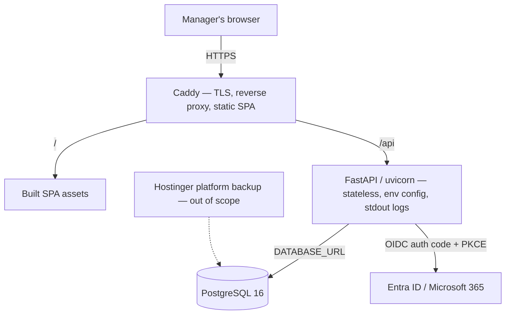

# Production Migration Design — Prototype to 12-Factor Application

*2026-08-04. How the local-first SPA becomes a deployed, durable system of
record without losing the trust anchor that makes it worth deploying.*

---

## 1. Why now

HANDOFF.md §4 Phase F predicted this document:

> This is the phase that forces the architecture decision the MVP deferred.
> Local-first with IndexedDB works for one person on one machine. […] The
> `SchedulerStore` interface (`src/state/persistence.js`) is the seam: swap the
> IndexedDB implementation for an API-backed one without touching the domain.
> **Do that deliberately as its own project, not as a side effect of an
> integration ticket.**

This is that project. Nothing external is forcing the timeline — the driver is
building the production-shaped version deliberately, before the clinic depends
on it, rather than retrofitting it under pressure later.

This spec follows that quote literally: the IndexedDB store is **swapped** for an
API-backed one, and Postgres becomes the authoritative store.

Because nothing is forcing the shape, the failure mode is not "too slow." It is
**building a distributed system for a problem that has one user.** Every piece of
the new architecture must earn its place against "what breaks if we don't."

## 2. Constraints

| Constraint | Value | Consequence |
|---|---|---|
| Driver | Build it right before rollout; nothing external forcing it | Optimize against over-build, not against schedule |
| Rollout | Office manager only, as **system of record** | Durability and correctness earn their place immediately; multi-user, roles, and notifications do not |
| Maintainers | Kasey (platform) + Tom (domain), part-time, both AI-assisted | Tolerates real architecture; ops burden must stay low; written contracts are load-bearing |
| Hosting | Hostinger VPS, self-managed | One `docker compose` host; Caddy for TLS; no managed-PaaS conveniences |
| Database | PostgreSQL | JSONB carries the document phase; better long-term fit than MySQL for this data shape |
| Identity | Entra ID (O365) SSO + break-glass local admin | Zero password management on the happy path; an IdP outage cannot lock out both maintainers |
| Backup / DR | **Handled by Hostinger platform services — out of scope for this spec** | Recorded explicitly so future sessions do not re-derive it as a gap |
| Working store | **Postgres is authoritative.** IndexedDB is retired as the store of record at SP2 | Server-authoritative editing; the app requires connectivity to edit |
| Deployment timing | **SP2 is gated on SP1's conformance report** — no containers spun up until the divergence between Approach B and the proven engine is measured | Avoids building persistence around semantics a parity run is about to change |

## 3. Decisions made — do not relitigate without new information

| # | Decision | Why |
|---|---|---|
| 1 | Strangler-fig, persistence first — not a big-bang rewrite | The app stays usable and provably correct at every step; each phase is independently valuable; there is a natural stopping point if priorities change |
| 2 | The Excel parity fixture becomes a **language-neutral cross-engine oracle** | `src/domain` stays frozen as the reference implementation that provably reproduces the workbook. OMS — and later the Python engine — must agree with it on Aug 2–8. Every port step gets an objective pass/fail gate |
| 3 | The rollout milestone lands at **SP2**, before any Python domain logic or TypeScript exists | Prevents this plan from becoming a backend-first rewrite in disguise |
| 4 | Postgres over MySQL | JSONB carries the document phase without schema churn; Tom's ERD lands later as a migration, not a rewrite |
| 5 | Two tracks with three explicit seams (§5) | The lock-screen clobber (§5.1) is what uncoordinated parallel work costs in this repo |
| 6 | **Server-authoritative: online-only editing plus a read-only last-known-good cache** | Postgres holds the document; the browser edits against the API. A silent offline edit that fails to sync later is worse than an honest error at the time. *(Local-first was adopted 2026-08-04 and reverted the same day after the Kasey/Tom meeting — this is the standing decision.)* |
| 7 | Single `revision` integer guards the document against lost updates | Data integrity, not concurrency. One column and one `WHERE` clause; no UI surface |
| 8 | **SP2 is gated on SP1's conformance report** (revised 2026-08-04, replacing "gated on Track D being green") | The original gate was justified partly by local-first — SP2 could wait because the manager still worked offline. Decision 6's reversal removed that justification, and "dialed in and green" was never objectively testable. SP1's divergence report is: it either exists or it doesn't. SP0 and SP1 carry the near-term work |

## 4. Decomposition and sequencing

Seven sub-projects. Each gets its own spec → plan → build cycle; this document
specs only their shape and order.

| # | Sub-project | Delivers |
|---|---|---|
| **SP0** | **Stabilize the base** | Green test suite; the two-engine ambiguity resolved *in writing* — OMS is the live UI, `src/domain` is the frozen reference oracle; CLAUDE.md updated to describe the layers that actually exist |
| **SP1** | **Parity conformance suite** | `conformance/aug02/` — inputs and expected outputs as language-neutral JSON, a documented contract, and a JS runner. Reports where OMS diverges from the proven engine |
| **SP2** | **12-factor envelope + document API** *(gated on SP1's conformance report — see §3.8; auth deferred per decision 19; split 2a/2b — see HANDOFF §5)* | FastAPI + Postgres + Alembic + Docker Compose + Caddy. Frontend swaps `SchedulerStore` from IndexedDB to API-backed; Postgres becomes authoritative. ~~Entra OIDC~~ deferred. **← ROLLOUT MILESTONE** |
| **SP3** | **Python engine port** | Scheduling semantics in Python, server-side, gated on SP1 |
| **SP4** | **TypeScript migration** | Incremental `allowJs` conversion; API client types generated from the OpenAPI schema |
| **SP5** | **Relational deepening** | Schedule modeled as tables rather than JSONB — a *derivation of Tom's ERD*, scheduled when queries demand it |
| **SP6** | **Integrations** | Paylocity / WhenIWork (HANDOFF Phase F), unblocked by SP2 |

### The load-bearing claim

A trustworthy system of record is reached at **SP2 — without a line of Python
domain logic or a line of TypeScript.** Everything from SP3 onward is foundation
for the next five years, not for the rollout.

SP2 deliberately ships a Python backend whose only job is storing a document the
JavaScript frontend already understands. That thinness is the design: it makes
the risky part — deployment, auth, and identity on a self-hosted box — fail early
and cheap, while the engine already in use keeps running untouched.

**Consequence of the server-authoritative decision (§3.6):** once SP2 lands, the
VPS sits between the manager and her schedule. Availability becomes a
correctness concern rather than a convenience one, and the deployment cannot be
treated as a background nicety the way it could under local-first.

### SP1 is pulled forward to run beside SP0

Tom is formalizing the **OMS** model into an ERD, and OMS is the engine with **no
parity proof** — the OMS design doc lists the Excel parity tripwire under
*Deferred*, and `src/engine/generate.js:140` calls `src/domain` "the untouched
parity stack."

So he is putting rigor around semantics never checked against the real workbook.
If the Aug 2–8 fixture shows OMS diverges, the model changes and his ERD changes
with it. Running the check is roughly an afternoon; discovering the divergence
after the ERD is finished costs a rework cycle. **This is the highest-leverage
scheduling decision in the plan.**

### Track D status (updated 2026-08-04)

**HANDOFF §4 Phase A has happened.** The rulebook validation session with the
manager is complete, and Tom is applying those lessons now. This supersedes
HANDOFF's "do this first, before code" framing — the risk of productionizing an
unvalidated rulebook is retired.

**The Approach B cutover shipped on 2026-08-04** — departments nest their roles
and default needs, a new `src/model/omsSelectors.js` mediates access, and
`buildSeed`, `omsMutations`, `generate`, and `activeNeeds` were reworked to
match. `omsPersistence.js` bumped `SCHEMA` from 2 to 3, so the persisted
document shape changed with it. HANDOFF.md was rewritten around the new state.

**But Approach B is not the same as Track D's Phase A output, and an earlier
draft of this spec wrongly treated it as such.** Verified against this
repository on 2026-08-04: **Kenny Williams does not appear anywhere in `src/`,
and no ERD document exists in `docs/`.** HANDOFF §4.8 agrees — it still records
the Phase A corrections as living in a working copy that has not been pushed.

So the schema *shape* is settled and stable, but the rulebook *corrections* are
not in yet. SP1 can be built against the v3 document shape with confidence; what
it cannot yet assume is that the generator's semantics are final. If the Phase A
corrections change generator behaviour, some SP1 fixtures will need rewriting —
a smaller risk than the original one, but not zero.

Two further facts about the cutover matter to this spec:

- **The parity tripwire still passes.** `src/data/parity-aug02.test.js` is green
  after Approach B, so the frozen reference implementation is intact and decision
  2's oracle strategy is unaffected.
- **SP1 must target Approach B.** The conformance suite is built against the
  *current* OMS document shape (schema v3), not the Approach A shape that
  preceded it. Fixtures written against v2 would measure an engine that no
  longer exists.

## 5. Two-track working model

**Tom is not doing SP5.** SP5 is the *physical* schema — DDL, migrations,
indexes, constraints. Tom is doing **domain modeling**: entities, relationships,
and what makes a schedule valid. Different artifacts, different lifecycles,
different owners. Conflating them is what would put both maintainers in the same
file.

- **Track D — Domain (Tom).** Owns the ubiquitous language, the ERD and logical
  model, the rulebook, and what "valid" means. Does *not* own physical schema,
  migrations, infrastructure, or API implementation.
- **Track O — Platform (Kasey).** Owns the 12-factor envelope, deployment,
  Postgres operation, auth, CI, and the API surface. Does *not* own what the
  entities mean.

Track D runs continuously: **D1** domain model + ERD (in flight) → **D2**
conformance fixtures → **D3** rulebook validation with the manager. Track O runs
SP0 → SP1 → SP2 → SP3 → SP4.

### 5.1 What uncoordinated parallel work already cost

The lock screen was built and merged on 2026-07-27, with `LoginScreen` wired
into `src/ui/App.jsx`. The OMS branch then rewrote `App.jsx` wholesale on
2026-08-02, **silently dropping it**, and it was re-implemented from scratch on
2026-08-03. A full round of duplicated work, caused by two tracks editing one
file with no seam between them.

*This account is recorded in prose because it can no longer be recovered from
the repository. The commits that show it — and all other history before
2026-08-04 — did not survive the migration to this repo, which begins at a
single initial commit. Where earlier drafts of this spec cited SHAs, they have
been replaced with dates for that reason.*

### 5.2 The three seams

Everything crossing between tracks crosses through exactly one of these. Nothing
else is shared.

1. **Domain model doc + ERD** — `docs/`. Tom writes; Kasey consumes it to derive
   the physical schema at SP5. Prose and diagrams, so it cannot conflict in code.
2. **Conformance fixtures** — `conformance/aug02/expected.json`. **The
   load-bearing seam.** This turns tacit expertise into an executable artifact —
   the project's own stated mission, applied to the team. Authorship splits
   cleanly: the *initial* Aug 2–8 extraction is mechanical translation of the
   existing `src/data/expected-aug02.js` into JSON and belongs to Kasey in SP1;
   **every fixture after it, and the semantic verdict on whether a divergence is
   a bug or a correction, belongs to Tom.** Kasey owns the runners and CI
   wiring in all cases.
3. **OpenAPI schema** — generated by FastAPI, consumed by the frontend.
   Machine-checked, so drift fails the build rather than surfacing at 7am.

### 5.3 Friction mechanics

- **No wholesale file rewrites.** Additive changes to shared `src/` files; a
  rewrite is announced first. This is the rule that would have saved the lock
  screen.
- **The topology is a single shared repository.** `TomWCAH/oms` replaced the
  earlier `HinchK/scheduler` upstream-plus-fork arrangement on 2026-08-04. Both
  maintainers work in one repo and integrate by PR. That removes fork-sync churn,
  but it does **not** remove the characteristic failure of the old setup: **work
  that never leaves the working copy.** Track D's Phase A corrections (§4) are
  still exactly that. Push early and often — unpushed work is invisible to
  review, CI, and backup, whatever the topology.
- **Short-lived branches, merged daily.** `Option-A` and `August-2` lived long
  enough to clobber each other and produce a no-op merge PR (#4).
- **Ownership by directory.** `docs/` and `conformance/*/expected.json` → Tom.
  `backend/`, `infra/`, `.github/`, `conformance/runners/` → Kasey. Current
  `src/` is shared and gets the most care.
- **The repo's docs are the coordination medium.** CLAUDE.md is already stale —
  it documents `src/domain`, `src/data`, `src/import` and says nothing about
  `src/engine`, `src/model`, or `src/seed`. Fixing it is part of SP0.

Both maintainers drive AI agents that re-derive context from files every session,
cold. An ambiguous repo does not produce confusion, it produces **divergence** —
the two-engine situation is what that looks like. The written contract is the
agents' input, not process overhead.

## 6. Architecture

### 6.1 The seam

> **SP2a refinement (2026-08-09):** The dedicated SP2a design supersedes this
> section where it is more specific. The public method names remain
> `load` / `save` / `clear`, and revision remains internal, but the API adapter
> owns an envelope-level cache, serialized/coalesced saves, and explicit
> offline/stale errors. `OmsContext` gains a small save/read-only state machine.
> The server persists the scheduling projection without `doc.ui`; local UI
> navigation must not create authoritative revisions. See
> `2026-08-09-sp2a-document-api-design.md` §6.

**Note on which seam:** HANDOFF §4 named `src/state/persistence.js` — the legacy
`SchedulerStore`. That was correct when written, but the app now renders the OMS
layer, so the live seam is `src/state/omsPersistence.js`. Same shape, same
strategy; only the file moved. SP0 records this so the two documents stop
disagreeing.

`src/state/omsPersistence.js` exposes a three-method interface — `load`, `save`,
`clear` — over a `schemaVersion`-wrapped JSON payload, and already has two
implementations (`createOmsIdbStore`, `createOmsMemoryStore`).

SP2 adds `createOmsApiStore()` as a third implementation: the same three public
method names, HTTP instead of IndexedDB, with revision and cache-envelope details
hidden inside the adapter. `OmsContext` selects the implementation and handles
read-only/offline transitions; domain and engine code remain unchanged. The
`schemaVersion` check already in `deserializeOms` becomes the server-side
contract version.

`createOmsIdbStore` is retained but demoted to a **read-only last-known-good
cache** (§3.6): the manager can always see the last schedule the API served, but
edits require connectivity and fail honestly when it is absent.

### 6.2 Runtime topology

One VPS, one `docker compose` file.

- **Caddy** — TLS termination with automatic renewal, reverse proxy, and static
  file serving for the built SPA. No Node runtime in production.
- **api** — FastAPI/uvicorn. Stateless, config strictly from environment, logs as
  an unbuffered stdout stream, graceful shutdown and fast boot.
- **db** — Postgres 16 on a mounted volume, attached by URL so swapping to a
  managed instance later is a config change.

### 6.3 Data model at SP2 — three tables, deliberately

- **`schedule_document`** — the **authoritative** OMS doc as `JSONB`, plus a
  `revision` integer and a `schema_version` mirroring `deserializeOms`. Writes
  carry the base revision and the API rejects one whose base is not current —
  lost-update protection for a single user with two tabs or two devices, not
  concurrency control.
- **`schedule_document_history`** — every accepted write, appended. This is what
  makes it a system of record rather than a database with one row.
- ~~**`app_user`** — Entra object ID, email, and the break-glass credential
  hash.~~ **DEFERRED (decision 19).** SP2a ships the two document tables only;
  `updated_by`/`written_by` attribution columns are omitted or nullable until
  auth lands.

Alembic from the first migration, including SP2's initial schema, so there is
never an "existing database we have no migrations for." JSONB means Tom's ERD
arrives at SP5 as a migration rather than a rewrite.

### 6.4 Identity

> **DEFERRED (Kasey, 2026-08-09, HANDOFF decision 19).** Authentication is
> punted until a working scheduling product exists. Nothing in this section is
> built at SP2 — no Entra OIDC, no break-glass. The `src/ui/auth.js` doorbell
> stays as-is; it is not replaced yet. A deployed SP2b instance is gated at the
> **network** level (Caddy basic-auth / IP allowlist / private network), not by
> app auth. This whole section returns when auth is un-punted. Kept for that.

Entra ID via OIDC authorization code + PKCE. The FastAPI service is the
confidential client: it holds the secret and sets an HTTP-only, `Secure`,
`SameSite=Lax` session cookie. The SPA never handles a token.

Break-glass is a separate local password login, Argon2-hashed, **disabled by
default and enabled by environment variable** — present on the box without being
a standing attack surface.

This replaces `src/ui/auth.js`, whose `PASSWORD` constant ships inside the
JavaScript bundle and is a doorbell rather than authentication.

**Owner:** Kasey and Tom together handle the app registration in the WCAH tenant
— redirect URI and admin consent. No longer blocked on anyone outside the two
maintainers.

### 6.5 The twelve factors

Codebase and config separated (III) via env vars, a documented `.env.example`,
and no secrets in git. Dependencies declared explicitly (II) with a lockfile and
pinned base images. Backing services attached by URL (IV). Build/release/run
split (V) as image build → tagged release with config → `compose up`. Stateless
processes (VI). Port binding (VII) behind Caddy. Disposability (IX). Dev/prod
parity (X) by running the same compose file locally. Logs as event streams to
stdout (XI). Admin processes (XII) as one-off container runs for migrations and
backfills.

Factor VIII (concurrency / process scaling) is satisfied trivially at one user
and is not designed for. Backup and disaster recovery are handled by Hostinger
platform services and are out of scope.

## 7. Testing

- **Conformance suite (SP1)** is the oracle. Language-neutral fixtures run in
  both the JS and Python CI jobs; this is what makes SP3 safe.
- **Backend** — pytest against **real Postgres in a container**, not mocks, since
  durability is the entire point of SP2.
- **Frontend** — vitest, unblocked by SP0.
- **The existing parity test stays exactly as it is** until the conformance
  extraction supersedes it. There is no window where nothing guards the workbook.
- **CI** — GitHub Actions runs conformance, backend, and frontend tests on every
  PR; builds and pushes an image on merge to `main`. **Deploy is an explicit
  manual step**, not automatic: with two part-time maintainers, a push that
  silently redeploys the clinic's system of record on a Friday afternoon is a
  liability.

## 8. Frontend and TypeScript (SP4)

Incremental via `allowJs`; Vite needs no config change. Convert in value order,
not file order: **the generated API client and the document/domain types first**,
components last or never. Types at the network boundary are where TypeScript
pays; a typed `<Button>` is decoration. Generate client types from the OpenAPI
schema with `openapi-typescript` so seam #3 is machine-checked.

**Do not convert the engine.** If `src/engine` is being ported to Python in SP3,
typing it in SP4 is throwaway work. Convert around it and let the port delete it.

## 9. SP2 completion gate

SP2 is done when:

1. SP1 has reported its divergence findings, and the conformance suite is green
   (§3.8 gates the start of SP2 on the report existing).
2. ~~Entra ID login works end to end, and break-glass login works with the flag
   on.~~ **DEFERRED (decision 19)** — auth is punted. SP2b instead requires a
   network-level access gate in front of the app (Caddy basic-auth / IP
   allowlist / private network), verified before the instance is reachable.
3. The document round-trips through the API with `revision` enforced — a stale
   write is rejected.
4. The manager builds one real week against the deployed instance.
5. **With the API unreachable, the app degrades honestly** — the read-only cache
   still renders the last known schedule, and an attempted edit fails with a
   clear error rather than appearing to succeed. Server-authoritative makes this
   the failure path most worth testing.

Behavior, not infrastructure.

## 10. Non-goals

Written down so no future session thinks they were forgotten.

Multi-user, roles, permissions. Notifications. Mobile layout. OR-Tools or any
constraint solver. The internal shift market (epic Layer 4). PIMS demand
anchoring (epic Layer 5). Multi-tenancy. Kubernetes, service mesh,
microservices — this is one compose file on one VPS, and that is the correct
architecture for a 28-person single-site clinic with one scheduler. Real-time
collaboration. Conflict resolution or merge strategies beyond stale-base
rejection. **Offline editing** — the browser keeps a read-only cache for
viewing, but editing requires the API.

## 11. Question status

**Resolved 2026-08-04:**

1. **Offline behavior** — **server-authoritative, online-only editing plus a
   read-only last-known-good cache** (§3.6). Local-first was adopted on
   2026-08-04 and reverted the same day after the Kasey/Tom meeting; the
   FastAPI/Postgres plan stands as originally designed.
2. **Entra tenant access** — ~~Kasey and Tom are handling the app registration
   together.~~ **No longer a near-term action (decision 19, 2026-08-09):** auth
   is punted, so the WCAH app registration waits until auth is un-punted. Not on
   the SP2 critical path.
3. **HANDOFF Phase A** — the manager session is complete. Applying the lessons
   is still in progress (§4).
4. **Kenny Williams** — addressed in Tom's working copy, not yet in this repo.

*(Superseded 2026-08-04: items 3–4 above predate the repository tree-diff
verification recorded in the resolution below.)*

**Still open: Track D's Phase A output is not in the repository.** An earlier
draft of this spec recorded this as closed, on the reasoning that the Approach B
cutover proved Tom's work had landed. That was wrong — Approach B is the schema
cutover, a different piece of work. Verified against this repository on
2026-08-04: **no Kenny Williams anywhere in `src/`, no ERD in `docs/`**, and
HANDOFF §4.8 still describes the corrections as unpushed.

**Resolution (2026-08-04, conformance triage cycle):** the claim above is
retired. Tom's Phase A corrections were pushed to the previous repository
(`HinchK/scheduler`), chiefly in the Approach B commit `4d1de56`, and the
migration captured them: a tree diff shows the old repo's `main` is fully
contained in this repo's `main` — the only delta is the additive SP0/SP1
work. Kenny Williams no longer works at West Coast, so his absence from the
seed is correct rather than a pending fix. Generator semantics measured by
SP1 are therefore final. See
`docs/superpowers/specs/2026-08-04-conformance-triage-design.md` §2.

The consequence is narrower than the original framing but real: the v3 document
*shape* is stable enough to build SP1 fixtures against, but the generator's
*semantics* are not final, so Phase A corrections may invalidate some fixtures.

*(Superseded 2026-08-04: the resolution above establishes the corrections did
land, so the semantics-not-final consequence no longer applies. See the
conformance triage spec §2.)*

**Remaining risks, both carried over rather than new:**

1. **The OMS engine still has no parity proof.** Approach B changed the document
   shape (schema v2 → v3) and reworked the generator, and it did so without an
   Excel-parity gate. `src/domain` remains the only implementation proven against
   the workbook. This is exactly what SP1 exists to measure, and Approach B
   raises rather than lowers its value.
2. **`main` is red.** 9 failing tests across `src/ui/App.test.jsx` and
   `src/ui/auth.test.js`, all from `localStorage` being undefined under Node 26
   in vitest's jsdom environment — an environment problem, not a logic
   regression. Unchanged by Approach B. SP0's first item.

## 12. What gets planned next

This document specs seven sub-projects; it is **not** a seven-project
implementation plan. The plan that follows it covers **SP0 and SP1 only** —
stabilizing the base and standing up the conformance suite — because SP1's
output (where OMS diverges from the proven engine) is a direct input to Tom's
in-flight ERD and may change what SP2 persists.

SP2 gets its own spec and plan once SP1 has reported (§3.8). Each later
sub-project follows the same cycle: spec → plan → build.

**Prerequisite status.** The Approach B cutover has shipped, so SP1 has a stable
*shape* to target: build the conformance fixtures against the **Approach B
document shape (schema v3)**. Tom's Phase A corrections have **not** landed in
this repository (§11), so the generator's semantics are not yet final and some
fixtures may need rewriting once they do. That is a known, bounded cost — not a
reason to delay SP1, whose whole purpose is to measure exactly this kind of
divergence.

*(Superseded 2026-08-04: the §11 resolution establishes the Phase A corrections
did land and generator semantics are final. See the conformance triage spec
§2.)*

