# OMS Modular Database Schema Design (v2)

*2026-08-07. Version 2 — expands the 2026-08-05 module-boundary proposal into
the full long-term table catalog for Scheduling operations, shared core,
Commission placeholders, and the SP2 platform envelope.*

**Status:** PROPOSED — NOT FINAL  
**Version:** 2  
**Supersedes:** `docs/superpowers/specs/2026-08-05-oms-modular-database-schema-design.md`  
**Decision owner:** Tom (domain boundaries and Scheduling table inventory)  
**Required reviewer:** Kasey (Postgres, migrations, and platform feasibility)  
**Logical model source:** `docs/oms-domain-model.md` + Track D rulings  
**Physical DDL / Alembic:** Track O (Kasey) — this document is the ERD seam,
not migration scripts.

## Feedback incorporated (v1 → v2)

| Source | What changed in v2 |
|--------|--------------------|
| Track D rulings / schema v4 | No home department; standing week = sequence-1 rotation; permanent OFF is rotation cells only; employee-scope facts are not constraint rows; `counts_toward_need` on role; location-scoped coverage; DVM **count** is generation input; team assignment is a later table |
| Domain model outline | Full entity inventory with SP5 table targets |
| Production migration §6.3 | Explicit `platform` tables for SP2 JSONB document + history + `app_user` |
| Non-standard shift hours | Optional `start_time` / `end_time` / `paid_hours` / `time_note` on ROLE rotation cells; no custom-hours shift-template catalog |
| Modular v1 (Tom-approved) | Keep module schemas (`core` / `scheduling` / `commission`); expand from ownership bullets to named tables + key columns |
| Open identity-map question | Resolved here: external ids live in `core.external_identity` (shared across modules) |

## Goal

One OMS application and one PostgreSQL database remain understandable as
Scheduling, Commission, and future modules land. A person viewing the database
can tell which schema owns every table. The catalog below is the **long-term
relational target** (SP5 and beyond). SP2 still ships the thin JSONB envelope;
relational deepening migrates into these tables without rewriting auth or
module boundaries.

This design describes ownership, table inventory, key columns, and invariants.
It does not prescribe final DDL types, indexes, or migration mechanics.

## Decision

Use PostgreSQL schemas as module boundaries:

| Schema | Owns |
|--------|------|
| `platform` | Auth, document envelope / history, session-of-record mechanics |
| `core` | Facts shared across OMS modules (employee identity, titles, locations, employment) |
| `scheduling` | All Scheduling-only configuration, weeks, PTO, runs, assignments |
| `commission` | Commission-only plans, rates, runs, payouts (provisional until Commission ships) |
| *(future)* | Each new module gets its own full-name schema |

Modules may foreign-key to `core` and `platform` identity. One module must not
hold a foreign key to another module's private tables. Cross-module reporting
uses views or read models.

This is the selected “module schemas” approach. It is unrelated to the earlier
Scheduling “Approach A” taxonomy design.

## Naming convention

1. Schema names use the full module name: `scheduling`, not `sched`.
2. Table names are singular entity names without redundant module prefixes:
   `scheduling.rotation`, not `scheduling.scheduling_rotation`.
3. Primary keys use stable surrogate IDs (UUID or text ids matching today's
   seed ids during migration — Track O chooses the physical type).
4. Foreign keys use the referenced entity name plus `_id`, such as
   `employee_id`.
5. Timestamps are `timestamptz`; calendar dates are `date`; week anchors are
   Sunday dates.
6. Soft enums (`status`, `type_code`, `kind`) are text checked by application /
   constraint catalog — Track O may later promote closed sets to Postgres enums.

---

## 1. `platform` — SP2 envelope (ships first)

These three tables are the production-migration §6.3 rollout. They remain even
after SP5 relational deepening: history and auth do not move into `scheduling`.

> **Kasey annotation (2026-08-09):** authentication is punted (HANDOFF decision
> 19), so `platform.app_user` and the `updated_by_user_id` / `written_by_user_id`
> FKs are **deferred** at SP2. SP2a ships only `platform.schedule_document` and
> `platform.schedule_document_history`, with the `*_by_user_id` columns omitted
> or nullable until auth lands. `app_user` below is retained as the target shape
> for when it does.

### `platform.app_user`

| Column | Notes |
|--------|-------|
| `id` | PK |
| `entra_object_id` | Unique; Microsoft Entra subject |
| `email` | |
| `display_name` | Optional |
| `break_glass_password_hash` | Argon2; login path disabled unless env flag set |
| `active` | |
| `created_at`, `updated_at` | |

### `platform.schedule_document`

Authoritative Scheduling document while JSONB is the working store.

| Column | Notes |
|--------|-------|
| `id` | PK (single-hospital MVP may use one row) |
| `schema_version` | Mirrors `deserializeOms` wrapper (`4` today) |
| `revision` | Integer; writes carry base revision for lost-update rejection |
| `doc` | `JSONB` — full Approach B / v4 HospitalDocument |
| `updated_by_user_id` | → `platform.app_user` |
| `updated_at` | |

### `platform.schedule_document_history`

Append-only accepted writes — system of record.

| Column | Notes |
|--------|-------|
| `id` | PK |
| `document_id` | → `schedule_document` |
| `revision` | |
| `schema_version` | |
| `doc` | `JSONB` snapshot |
| `written_by_user_id` | → `platform.app_user` |
| `written_at` | |

SP5 migrates domain content out of `doc` into `core` / `scheduling` tables.
Whether `schedule_document` shrinks to a projection, a cache, or is retired is
a Track O migration decision; history rows remain immutable.

---

## 2. `core` — shared employee and organization facts

OMS manages employees only; a separate `person` abstraction is not justified.
Employee id stays stable across termination and rehire.

### `core.location`

| Column | Notes |
|--------|-------|
| `id`, `code`, `name` | LV Linda Vista; PB Pacific Beach |
| `active` | |

### `core.title`

| Column | Notes |
|--------|-------|
| `id`, `code`, `name`, `rank` | CSR, VA, RVT, DVM |
| `active` | |

A Scheduling **role** is not a title. Assignability (Dental Monitor, Room Tech)
belongs in `scheduling.role`.

### `core.employee`

| Column | Notes |
|--------|-------|
| `id` | Stable identity |
| `display_name` | |
| `status` | e.g. `active` / `inactive` |
| `primary_title_id` | Optional convenience → `core.title` (history in `employee_title`) |
| `created_at`, `updated_at` | |

### `core.employment_period`

| Column | Notes |
|--------|-------|
| `id` | |
| `employee_id` | → `core.employee` |
| `hired_on` | |
| `terminated_on` | Null while employed |
| `notes` | |

Rehire creates a **new** employment period for the same `employee_id`.

### `core.employee_title`

| Column | Notes |
|--------|-------|
| `id` | |
| `employee_id` | → `core.employee` |
| `title_id` | → `core.title` |
| `effective_from`, `effective_to` | |

### `core.employee_location`

Organization-level location association when the fact is shared by modules
(not Scheduling assignment preference — that is `scheduling.location_eligibility`).

| Column | Notes |
|--------|-------|
| `id` | |
| `employee_id` | → `core.employee` |
| `location_id` | → `core.location` |
| `is_home` | At most one home per employee when used |
| `effective_from`, `effective_to` | |

### `core.external_identity`

Cross-cutting external keys (Paylocity, future WhenIWork, etc.). Owned by
`core` so Commission and Scheduling can both resolve the same person.

| Column | Notes |
|--------|-------|
| `id` | |
| `employee_id` | → `core.employee` |
| `system` | e.g. `paylocity` |
| `external_key` | Unique per `(system, external_key)` |

---

## 3. `scheduling` — long-term Scheduling operations

All tables below are required for long-term Scheduling operations once
relational deepening lands. Until then they live inside
`platform.schedule_document.doc` JSONB.

### 3.1 Catalogs and hospital policy

#### `scheduling.shift_pattern`

Default paid-hours template (e.g. STANDARD_B = 10h). Custom per-day hours are
**not** additional catalog rows — they live on `rotation_cell`.

| Column | Notes |
|--------|-------|
| `id`, `code`, `name` | |
| `start_time`, `end_time` | Display defaults |
| `unpaid_meal_minutes` | |
| `paid_hours` | Authoritative default when cell omits hours |

#### `scheduling.hospital_constraint`

Hospital-scoped rules (GLOBAL). Machine types in active use:

- `TARGET_HOURS` — weight for missing per-employee `target_hours`
- `REST_PATTERN` — min consecutive off; waived per employee by
  `employee_profile.consecutive_off_exempt`
- `GENERAL_FILL_MAX_OVERAGE_HOURS` — overage cap during general fill (default 10);
  carries a weight like all other constraints
- `NOTE` — human rationale only

| Column | Notes |
|--------|-------|
| `id` | |
| `type_code` | |
| `name` | |
| `parameters` | JSONB |
| `weight` | |
| `temporal_scope` | e.g. `WEEK` |
| `machine_consumable` | |
| `rationale`, `owner`, `source_ref` | Provenance |
| `active` | |

`SystemConfig` as a separate catalog is **rejected** — overage is a constraint
row, not a key/value map.

### 3.2 Department aggregate

#### `scheduling.department`

| Column | Notes |
|--------|-------|
| `id`, `code`, `name`, `description` | ROOM, SURGERY, DENTAL, HSS, PHARM, CSR, ADMIN |
| `active` | |

#### `scheduling.role`

| Column | Notes |
|--------|-------|
| `id` | |
| `department_id` | → `department` |
| `code`, `name`, `description` | |
| `min_title_id` | → `core.title` (nullable) |
| `counts_toward_need` | **I15** — whether assignments to this role satisfy coverage needs |
| `active` | |

No `department_authorization` table — role eligibility implies department
authorization (**I1**).

#### `scheduling.default_need`

Mon–Sat templates. Week Setup never mutates these (**I2**).

| Column | Notes |
|--------|-------|
| `id` | |
| `department_id` | → `department` |
| `location_id` | → `core.location` (coverage is location-scoped, **I14**) |
| `day_of_week` | Sun…Sat |
| `role_id` | → `role` |
| `quantity` | Nullable if `formula` set |
| `formula` | e.g. `2 * DVMs` |
| `condition` | Optional |
| `weight` | |

#### `scheduling.department_constraint`

Same shape as hospital constraints; subject is a department (e.g.
`ORDERED_PREFERENCE` pull / backup order).

| Column | Notes |
|--------|-------|
| `id` | |
| `department_id` | → `department` |
| `type_code`, `name`, `parameters`, `weight`, … | Same provenance fields as hospital |

### 3.3 Employee scheduling profile and preferences

#### `scheduling.employee_profile`

Scheduling-owned facts for a `core.employee`. **No `home_department_id` (I10).**

| Column | Notes |
|--------|-------|
| `employee_id` | PK / FK → `core.employee` |
| `target_hours` | Weekly target |
| `home_location_id` | → `core.location` |
| `default_shift_pattern_id` | → `shift_pattern` |
| `consecutive_off_exempt` | Waives hospital `REST_PATTERN` |
| `notes` | Human rationale (not a NOTE constraint) |
| `external_ref` | Display / import aid; durable external keys stay in `core.external_identity` |
| `synthetic` | True for seed DVM placeholders if still needed transitional |
| `active` | |

#### `scheduling.role_eligibility`

| Column | Notes |
|--------|-------|
| `id` | |
| `employee_id` | → `core.employee` |
| `role_id` | → `role` |
| `rank` | Preference order |
| `weight` | |
| `burnout_days` | Optional |

Eligible ⇒ engine may place. **No `auto_assign` flag (I12).** Manager may place
anyone regardless of eligibility.

#### `scheduling.location_eligibility`

Assignment-policy ranks (who may work PB vs LV). Day-level “work at PB”
pins use `@LOCATION` on rotation / assignment cells, not a
`LOCATION_ELIGIBILITY` constraint type.

| Column | Notes |
|--------|-------|
| `id` | |
| `employee_id` | → `core.employee` |
| `location_id` | → `core.location` |
| `rank` | |

#### `scheduling.employee_constraint`

Escape hatch only. Seed emits **none** (**I13**). Standing days, weekly
targets, rest waivers, and notes use rotations / profile columns / hospital
constraints instead. Table exists so genuine one-offs have a home without
reviving employee-scope as the default.

| Column | Notes |
|--------|-------|
| `id` | |
| `employee_id` | → `core.employee` |
| `type_code`, `name`, `parameters`, `weight`, … | Same shape as other constraints |

### 3.4 Rotations (standing week and multi-week cycles)

Standing week is a **sequence-1 rotation** — not `FIXED_ASSIGNMENT` constraints.

#### `scheduling.rotation`

| Column | Notes |
|--------|-------|
| `id` | |
| `employee_id` | → `core.employee` |
| `sequence` | `1..N`; after N comes 1 |
| `anchor_date` | Shared Sunday for the cycle |
| `active` | |

Optional: zero rotations ⇒ flexible outside other constraints.

#### `scheduling.rotation_cell`

| Column | Notes |
|--------|-------|
| `id` | |
| `rotation_id` | → `rotation` |
| `day_of_week` | Sun…Sat |
| `kind` | `ROLE` \| `OFF` \| `ANY` |
| `role_id` | Required when `kind = ROLE` |
| `location_id` | Optional `@LOCATION` away from home |
| `paid_hours` | Optional; default 10 when omitted on ROLE |
| `start_time`, `end_time` | Optional custom hours (ROLE only) |
| `time_note` | System-built display from start/end |
| `label` | Optional free-form segment |
| `weight` | Optional |

Grammar authoring surface remains
`CODE[@LOCATION][/HOURS][ (note)]` in workbook / UI; this table is the
normalized form. Coverage counts headcount; weekly targets use `paid_hours`.

### 3.5 Time off

#### `scheduling.time_off_request`

| Column | Notes |
|--------|-------|
| `id` | |
| `employee_id` | → `core.employee` |
| `start_date`, `end_date` | |
| `hours` | |
| `status` | `PENDING` / `APPROVED` / `DENIED` / `HOLD` |
| `derived_type` | `PAID_PTO` / `PARTIAL` / `UNPAID` (classifier output) |
| `reason`, `notes` | |
| `submitted_at` | |
| `director_override` | Optional flag |

#### `scheduling.time_off_day_ruling`

Per-day adjudication inside a multi-day request.

| Column | Notes |
|--------|-------|
| `id` | |
| `request_id` | → `time_off_request` |
| `work_date` | |
| `status` | |
| `reason` | Optional |

Ephemeral PTO board preview UI state is **not** persisted.

### 3.6 Schedule weeks, setup, overrides, publish

#### `scheduling.schedule_week`

| Column | Notes |
|--------|-------|
| `id` | |
| `week_start` | Sunday; unique |
| `state` | `DRAFT` / `FINAL` / `PUBLISHED` |
| `label`, `notes` | |
| `finalized_by_user_id`, `finalized_at` | |
| `published_by_user_id`, `published_at` | |
| `publish_ack` | JSONB — acknowledged gaps / hard-violation waivers at publish |

Board location view (PB ↔ LV) is UI state, not a week column — assignments
carry `location_id`.

#### `scheduling.day_plan`

| Column | Notes |
|--------|-------|
| `id` | |
| `week_id` | → `schedule_week` |
| `day_of_week` | |
| `work_date` | Optional denormalized calendar date |
| `dvm_count` | Permanent generation input (**I9**) — not named DVMs |

#### `scheduling.day_plan_department`

Enabled departments for that day (`departmentsEnabled`).

| Column | Notes |
|--------|-------|
| `day_plan_id` | → `day_plan` |
| `department_id` | → `department` |
| `weight` | |

#### `scheduling.need_override`

Week-local quantity/formula change or clear. Never mutates `default_need`.

| Column | Notes |
|--------|-------|
| `id` | |
| `day_plan_id` | → `day_plan` |
| `role_id` | → `role` |
| `quantity`, `formula`, `weight` | Optional |
| `cleared` | `true` ⇒ no need for this role this day |

#### `scheduling.cell_override`

Manager Week Board edits that pin or clear a person×day before / after generate.

| Column | Notes |
|--------|-------|
| `id` | |
| `week_id` | → `schedule_week` |
| `employee_id` | → `core.employee` |
| `day_of_week` | |
| `kind` | e.g. `OFF`, `ROLE`, clear |
| `role_id`, `department_id`, `location_id` | As applicable |
| `paid_hours`, `label`, `time_note` | Optional |
| `source` | `OVERRIDE` |

Unique `(week_id, employee_id, day_of_week)` — one override cell per person-day
(**I8** across locations is enforced on resulting assignments).

#### `scheduling.violation_authorization`

Publish-gate waivers for known hard/soft violations.

| Column | Notes |
|--------|-------|
| `id` | |
| `week_id` | → `schedule_week` |
| `violation_key` | Stable id / hash of the violation instance |
| `authorized` | |
| `authorized_by_user_id`, `authorized_at` | |
| `note` | |

### 3.7 Generation output (durable at SP5)

Today `generateWeek` is ephemeral inside the document / UI. Long-term
operations need queryable proposed and published schedules.

#### `scheduling.schedule_run`

| Column | Notes |
|--------|-------|
| `id` | |
| `week_id` | → `schedule_week` |
| `engine_version` | |
| `status` | e.g. `proposed` / `superseded` / `published_snapshot` |
| `generated_at` | |
| `generated_by_user_id` | |
| `input_fingerprint` | Optional hash of inputs for audit |

#### `scheduling.assignment`

| Column | Notes |
|--------|-------|
| `id` | |
| `run_id` | → `schedule_run` |
| `week_id` | → `schedule_week` (denorm for queries) |
| `employee_id` | → `core.employee` |
| `day_of_week`, `work_date` | |
| `role_id` | → `role` (nullable for pure OFF / PTO markers if stored) |
| `department_id` | → `department` |
| `location_id` | → `core.location` — required for coverage (**I14**) |
| `paid_hours` | |
| `counts_toward_need` | Copied from role at generate time for historical stability |
| `source` | `SOLVER` / `OVERRIDE` / `ROTATION` / `TIME_OFF` / … |
| `is_time_off` | |
| `time_note`, `label` | |
| `rotation_id`, `constraint_id` | Optional provenance |

Unique business rule: one working assignment per `(employee_id, work_date)`
across locations (**I8**).

Gaps and live violation lists are **computed** for the board. They are not
separate source-of-truth tables; only authorizations and publish acks persist.

### 3.8 Post-schedule team assignment (future, table reserved)

Named DVM + room-tech pairing happens **after** generation (**I9** / decision 16).

#### `scheduling.dvm_team_assignment`

| Column | Notes |
|--------|-------|
| `id` | |
| `week_id` | → `schedule_week` |
| `work_date` | |
| `location_id` | → `core.location` |
| `dvm_employee_id` | → `core.employee` |
| `tech_employee_id` | → `core.employee` |
| `assigned_by_user_id`, `assigned_at` | |

Not an input to schedule generation. Synergy/affinity grids remain out of
scope until separately ruled.

### 3.9 Transitional / non-durable

| Concept | Long-term fate |
|---------|----------------|
| Synthetic `dvm-synth-*` employees + `dvmDays[]` | Prefer `day_plan.dvm_count` only; drop synthetic employees when team assignment lands |
| `doc.ui.*`, week-order chrome | Client or thin `scheduling.ui_state` JSON if server must remember — not domain SoR |
| Makeup Shift | Ubiquitous language still empty — **no table until ruled** |

---

## 4. `commission` — provisional module tables

No product DDL exists yet. These tables reserve the boundary so Scheduling
JSONB never absorbs Commission data. Column lists are provisional until the
Commission design ships; names are stable enough for FK planning.

| Table | Purpose |
|-------|---------|
| `commission.plan` | Named commission plan |
| `commission.plan_version` | Effective-dated rates / tiers / rules (JSONB or child tables) |
| `commission.employee_eligibility` | Which `core.employee` rows participate in which plan |
| `commission.calculation_run` | A payroll/commission period run |
| `commission.payout_line` | Per-employee results for a run |

All employee FKs point at `core.employee` only.

---

## 5. Evolution path

```text
Now          IndexedDB JSON document (schema 4)
  │
  ▼
SP2          platform.schedule_document (+ history + app_user)
  │          doc JSONB still owns Scheduling content
  │
  ▼
Core extract Introduce core.* when Commission (or any 2nd module) needs
  │          shared employees; Scheduling JSONB references core ids
  │
  ▼
SP5          Relational deepening: scheduling.* tables derived from this ERD
  │          Migrate off JSONB aggregates incrementally
  ▼
Commission   commission.* against core.employee
```

Rules:

1. At SP2, the authoritative Scheduling document remains JSONB and must not
   absorb Commission data.
2. Extract `core` before any second module depends on employee identity.
3. Keep Scheduling-specific facts in `scheduling`, referencing stable core ids.
4. Do not convert every aggregate on day one — deepen when queries demand it.

---

## 6. Boundary tests

Before adding a field or table, ask:

1. Is this a fact about the organization or employee, or policy for one module?
2. Do multiple modules require the same fact with the same semantics?
3. Can the owning module change this representation without breaking another
   module?
4. Is a proposed cross-module dependency actually reporting or integration that
   should use a view, read model, or application interface?

If ownership is ambiguous, keep the data in the module that creates and governs
it until a real shared use case proves otherwise.

---

## 7. Invariants that shape the schema

| # | Invariant | Schema consequence |
|---|-----------|-------------------|
| I1 | Role eligibility ⇒ department auth | No dept-auth table |
| I2 | Week Setup writes overrides only | Separate `need_override` vs `default_need` |
| I3 | `ANY` / blank cell = no constraint | `rotation_cell.kind = ANY` |
| I4 | Overage cap is weighted hospital constraint | Row in `hospital_constraint`, not SystemConfig |
| I5 | Early leave is note-only | No early-leave hours column on overrides |
| I7–I8 | One location view; no same-day double book | `location_id` on needs/assignments; unique person-day |
| I9 | DVM **count** for generation | `day_plan.dvm_count`; team table is post-schedule |
| I10 | No home department | Preference = ranked `role_eligibility` |
| I11 | Permanent OFF = rotation only | No `unavailable_days` column |
| I12 | No `auto_assign` | Eligibility table without that flag |
| I13 | No single-employee facts as constraints | Profile columns + rotations; empty `employee_constraint` in seed |
| I14 | Coverage is location-scoped | `location_id` on needs and assignments |
| I15 | `counts_toward_need` on role | Column on `role`; copied onto assignment for history |

Dropped legacy types must not reappear as first-class tables or required
constraint rows: `DAY_AVAILABILITY`, `FIXED_DAY_SET`, `FIXED_ASSIGNMENT`,
`ROLE_ELIGIBILITY` (as constraint), `LOCATION_ELIGIBILITY` (as constraint),
`DEPARTMENT_AUTH`.

---

## 8. ERD (module view)

```mermaid
erDiagram
  platform_app_user ||--o{ platform_schedule_document : writes
  platform_schedule_document ||--o{ platform_schedule_document_history : versions

  core_employee ||--o{ core_employment_period : history
  core_employee ||--o{ core_employee_title : holds
  core_employee ||--o{ core_employee_location : associated
  core_employee ||--o{ core_external_identity : mapped
  core_title ||--o{ core_employee_title : title
  core_location ||--o{ core_employee_location : location

  core_employee ||--|| scheduling_employee_profile : scheduling_facts
  core_employee ||--o{ scheduling_role_eligibility : eligible
  core_employee ||--o{ scheduling_location_eligibility : eligible
  core_employee ||--o{ scheduling_rotation : optional
  core_employee ||--o{ scheduling_time_off_request : requests

  scheduling_department ||--|{ scheduling_role : contains
  scheduling_department ||--o{ scheduling_default_need : templates
  scheduling_department ||--o{ scheduling_department_constraint : owns
  scheduling_role ||--o{ scheduling_role_eligibility : role
  scheduling_role ||--o{ scheduling_default_need : role

  scheduling_rotation ||--|{ scheduling_rotation_cell : days
  scheduling_time_off_request ||--o{ scheduling_time_off_day_ruling : days

  scheduling_schedule_week ||--|{ scheduling_day_plan : seven
  scheduling_day_plan ||--o{ scheduling_day_plan_department : enabled
  scheduling_day_plan ||--o{ scheduling_need_override : week_local
  scheduling_schedule_week ||--o{ scheduling_cell_override : board
  scheduling_schedule_week ||--o{ scheduling_schedule_run : generates
  scheduling_schedule_run ||--o{ scheduling_assignment : produces
  scheduling_schedule_week ||--o{ scheduling_dvm_team_assignment : post_schedule

  core_employee ||--o{ commission_employee_eligibility : participates
  commission_plan ||--o{ commission_plan_version : versions
  commission_plan ||--o{ commission_employee_eligibility : plan
  commission_calculation_run ||--o{ commission_payout_line : lines
```



---

## 9. Table checklist (long-term complete set)

### platform
- [x] `app_user`
- [x] `schedule_document`
- [x] `schedule_document_history`

### core
- [x] `location`
- [x] `title`
- [x] `employee`
- [x] `employment_period`
- [x] `employee_title`
- [x] `employee_location`
- [x] `external_identity`

### scheduling
- [x] `shift_pattern`
- [x] `hospital_constraint`
- [x] `department`
- [x] `role`
- [x] `default_need`
- [x] `department_constraint`
- [x] `employee_profile`
- [x] `role_eligibility`
- [x] `location_eligibility`
- [x] `employee_constraint` (escape hatch)
- [x] `rotation`
- [x] `rotation_cell`
- [x] `time_off_request`
- [x] `time_off_day_ruling`
- [x] `schedule_week`
- [x] `day_plan`
- [x] `day_plan_department`
- [x] `need_override`
- [x] `cell_override`
- [x] `violation_authorization`
- [x] `schedule_run`
- [x] `assignment`
- [x] `dvm_team_assignment` (post-schedule)

### commission (provisional)
- [x] `plan`
- [x] `plan_version`
- [x] `employee_eligibility`
- [x] `calculation_run`
- [x] `payout_line`

### Explicitly out of schema until ruled
- Makeup Shift entity
- Gap / live Violation SoR tables
- Synergy / affinity grids
- Multi-tenant / RBAC / notification tables
- PIMS / Paylocity / WhenIWork integration staging beyond `external_identity`
- Custom-hours shift-template catalog

---

## 10. Kasey review gate

This proposal is not finalized until Kasey reviews:

- PostgreSQL schema and migration feasibility for per-module schemas
- ORM / Alembic ownership across `platform` / `core` / `scheduling` / `commission`
- Permissions for cross-schema FKs
- Timing of `core` extraction relative to SP2 and Commission
- Compatibility of SP5 deepening with `schedule_document` + history
- Physical id strategy (UUID vs stable text seed ids)

Record approval or requested changes in this document or a linked PR. Until
then, downstream documents must describe this design as **proposed**, not locked.

### Sign-off

- [x] Tom — domain direction (module schemas) approved 2026-08-05; v2 table
      inventory authored 2026-08-07
- [ ] Kasey — platform review pending

## Success criteria

- Database ownership is evident from every table's qualified name.
- Shared employee identity is represented once; rehire uses employment periods.
- The checklist in §9 covers long-term Scheduling operations without relying on
  undocumented JSON blobs after SP5.
- Track D invariants I1–I15 are expressible without legacy constraint tables.
- Scheduling and Commission can evolve independently against `core`.
- SP2 can ship on `platform.*` without waiting for full relational deepening.
- Kasey has reviewed and signed off before the design is marked final.
