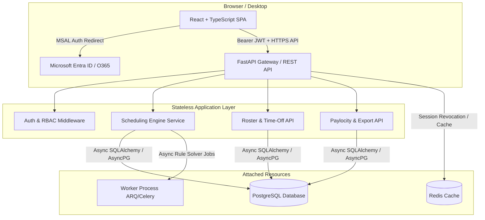
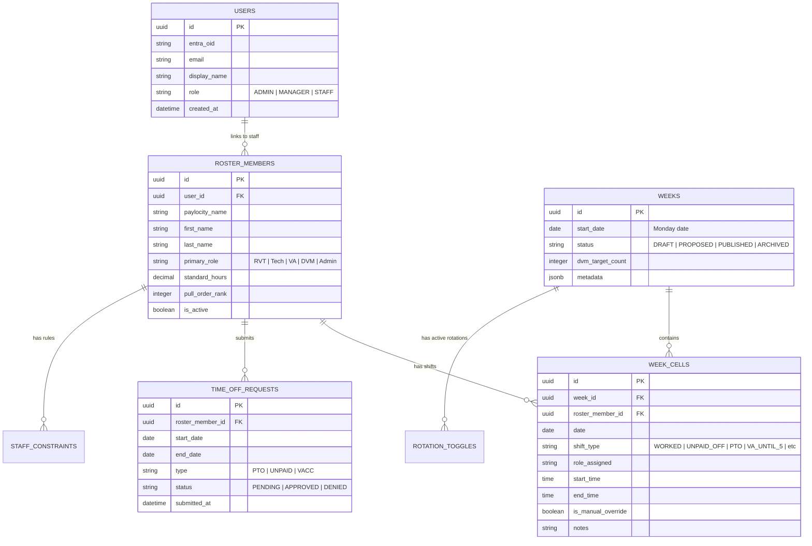
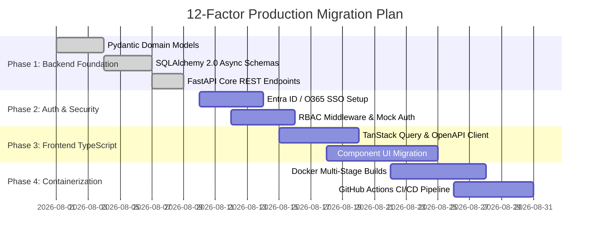

# Architecture Plan: 12-Factor Production Transformation for WCAH Scheduler

This document details the strategic architecture and migration roadmap to elevate the **WCAH Scheduler** from its initial local-first JavaScript prototype into an enterprise-grade, **12-Factor compliant** application featuring a Python (FastAPI) backend, PostgreSQL database, React + TypeScript frontend, and Office 365 / Entra ID SSO.

---

## 1. Executive Summary & Architecture Goals

### Prototype Baseline
* **Stack**: Vite + React (JavaScript, JSDoc) local-first single-page application.
* **State & Persistence**: In-memory + IndexedDB (`SchedulerStore`), JSON import/export.
* **Business Logic**: Pure JavaScript engine in `src/domain/` executing 10+ rule templates, rotation engines, and coverage solvers against Excel-derived ground truth.

### Target 12-Factor Production Architecture
* **Backend**: Python 3.12+ / FastAPI with SQLAlchemy 2.0 (async), Pydantic v2, and Alembic migrations.
* **Database**: PostgreSQL with ACID compliance, relational integrity, and historical schedule audit logs.
* **Frontend**: React + TypeScript (Vite), migrated to TanStack Query (React Query) communicating with auto-generated OpenAPI types.
* **Auth**: Microsoft Entra ID (Office 365) OAuth 2.0 / OIDC SSO with Role-Based Access Control (RBAC).
* **Compliance**: Strict adherence to [The Twelve-Factor App](https://12factor.net/) principles for cloud-native deployment.

---

## 2. 12-Factor Alignment Matrix

| Factor | Principle | Architectural Implementation |
|---|---|---|
| **I. Codebase** | One codebase tracked in revision control, many deploys | Standardized Monorepo containing `/backend` (FastAPI), `/frontend` (React TS), `/docs`, and shared OpenAPI schemas. |
| **II. Dependencies** | Explicitly declare and isolate dependencies | Backend: `pyproject.toml` (managed via `uv` or `poetry`) + Docker isolated containers. Frontend: `package.json` with locked `pnpm`/`npm` dependencies. |
| **III. Config** | Store config in the environment | Pydantic `BaseSettings` reading environment variables (`DATABASE_URL`, `O365_CLIENT_ID`, `O365_TENANT_ID`, `JWT_SECRET_KEY`). Zero hardcoded credentials or environment-specific logic. |
| **IV. Backing Services** | Treat backing services as attached resources | PostgreSQL, Redis (session/cache/task queue), and S3-compatible storage treated as URL-bound attached resources configured via env vars. |
| **V. Build, Release, Run** | Strictly separate build and run stages | CI/CD (GitHub Actions) builds immutable Docker images (Build), tags with Git SHA + env config (Release), and executes via container orchestrator (Run). |
| **VI. Processes** | Execute the app as stateless processes | FastAPI backend processes are fully stateless. Session state stored in JWT / Redis. Client local state replaced by database queries. |
| **VII. Port Binding** | Export services via port binding | FastAPI exports HTTP via Uvicorn bound to `$PORT` (e.g. `8000`), reverse-proxied by Nginx / Cloud Ingress / ALB. |
| **VIII. Concurrency** | Scale out via process model | Horizontal scaling of Uvicorn workers and container replicas. Asynchronous background jobs (e.g., heavy schedule optimization/generation) offloaded to ARQ / Celery workers. |
| **IX. Disposability** | Fast startup and graceful shutdown | FastAPI & Uvicorn support SIGTERM handling for graceful connection draining. Container startup target < 3 seconds. |
| **X. Dev/Prod Parity** | Keep dev, staging, prod as similar as possible | Local dev powered by `docker-compose` running identical PostgreSQL and Redis versions. Mock O365 SSO mode for local off-line development. |
| **XI. Logs** | Treat logs as event streams | JSON structured logging via `structlog` outputting to `stdout`/`stderr`. Captured by container agents (CloudWatch, Datadog, Loki). |
| **XII. Admin Processes** | Run admin/management tasks as one-off processes | Database migrations (`alembic upgrade head`) and seed data scripts run as isolated release tasks prior to app deployment. |

---

## 3. Architecture & Data Model

### Target Architecture Diagram

### Relational Database Schema Design (PostgreSQL)

---

## 4. Implementation Phases

