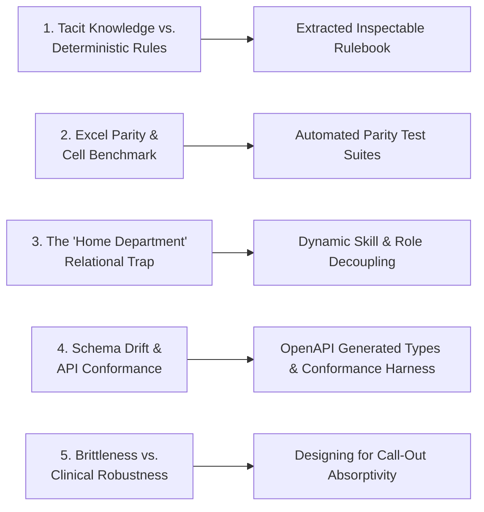

# Engineering Challenges Met & Lessons Learned

> *A transparent technical retrospective on the unforeseen domain edge cases, architectural collisions, and organizational insights discovered during the WCAH OMS initiative.*

---

## 🧗 Key Engineering Challenges

---

### Challenge 1: Tacit Knowledge vs. Deterministic Rules
* **The Collision**: In initial interviews, the hospital scheduler reported that she built schedules "from scratch" using intuition.
* **The Reality**: Pure intuition cannot schedule 60 credentialed medical staff members consistently. There was an underlying mental model consisting of ~15 hard legal constraints (e.g. DVM:VA mandatory coverage, overtime thresholds, mandatory rest periods) and dozens of soft preferences (e.g. weekend rotations, doctor-tech pairings).
* **The Lesson**: **Never ask an expert for their algorithm; ask them to critique a proposed output.** By showing the scheduler drafted schedules and recording why she rejected specific shift placements, the engineering team quickly extracted 100% of the tacit rules into software.

---

### Challenge 2: Excel Benchmark Ground-Truth Parity
* **The Collision**: The clinic's existing August 2026 schedule spreadsheet had subtle manual exceptions (e.g., Kenny Williams RVT working split hours, specialized Sunday surgery coverage).
* **The Reality**: If the software produced a schedule that differed from the scheduler's historical baseline without explanation, clinical leadership would lose confidence in the system.
* **The Lesson**: **Build an automated parity test suite early.** In `oms-v0`, we created cell-by-cell regression tests (`parity-aug02.test.js`) asserting exact row-by-row match against the benchmark workbook. This gave the team mathematical proof that the algorithmic engine was sound.

---

### Challenge 3: The "Home Department" Relational Trap
* **The Collision**: Early relational schemas (in `oms-v0` and early `oms-v1`) assigned each employee a single `home_department_id` (e.g., "Surgery", "Inpatient", "Dental").
* **The Reality**: In veterinary clinical practice, technicians and assistants are cross-trained. A technician might assist in Surgery on Monday, run Outpatient triage on Wednesday, and work the Pharmacy desk on Friday. Forcing staff into rigid departmental silos caused severe scheduling artificial shortages.
* **The Lesson**: **Decouple organizational hierarchy from clinical capability.** On August 5, 2026 (Track D Rulings), the team explicitly dropped `home_department` in favor of dynamic **skill profiles and credential tags**.

---

### Challenge 4: Frontend/Backend Schema Drift
* **The Collision**: During Generation 2 (`oms-v1`), the FastAPI backend models and the Vite React frontend types were updated in parallel during fast-moving sprints, occasionally creating schema mismatches in payload shapes.
* **The Lesson**: **Invest in strict conformance test harnesses and auto-generated OpenAPI bindings.** We instituted a conformance test suite (`conformance/contract.md`) and adopted OpenAPI type generation, guaranteeing that backend schema updates immediately surfaced as compile-time type errors on the frontend.

---

### Challenge 5: Optimality vs. Clinical Recoverability
* **The Collision**: The naive mathematical impulse was to configure an integer-programming solver to produce a "theoretically optimal" schedule with zero excess hours.
* **The Reality**: A mathematically tight schedule has zero buffer. In a veterinary emergency hospital, staff members call in sick, emergency C-sections arrive, and surgeries run over. A tightly optimized roster collapses upon the first disruption.
* **The Lesson**: **Optimize for recoverability and call-out absorptivity.** The platform measures how many single-staff callouts a schedule can absorb before violating a hard clinical constraint.
