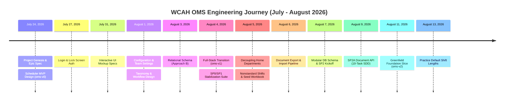

# Chronological Timeline of the WCAH OMS Platform

> *The architectural evolution of the WCAH Operations Management System across all iterations, design breakthroughs, and milestone deliveries.*

---

## 📅 Platform Evolution Overview

---

## 🔍 Detailed Sprint Milestones & Cross-Tenant Links

### Generation 1: Scheduler MVP ([`oms-v0`](/oms-v0/)) — July 24 – August 3, 2026

The initial rapid-prototyping phase focused on extracting tacit scheduling expertise from hospital spreadsheets into a fast, local-first JavaScript engine.

* **July 24, 2026** — **[Scheduler MVP Design](/oms-v0/#spec-scheduler-mvp)**  
  *Artifacts*: [Specification](/oms-v0/#spec-scheduler-mvp) · [Implementation Plan](/oms-v0/#plan-scheduler-mvp)  
  *Milestone*: Established the core domain entities (`Roster`, `Week`, `Shift`, `Rotation`), 10+ rule templates, and 100% cell-by-cell parity with historical August 2026 Excel schedule benchmarks.
* **July 27, 2026** — **[Login & Lock Screen Authentication](/oms-v0/#spec-login-lock-screen)**  
  *Artifacts*: [Specification](/oms-v0/#spec-login-lock-screen) · [Implementation Plan](/oms-v0/#plan-login-lock-screen)  
  *Milestone*: Implemented fast PIN-based clinical terminal locking and role-based staff switching.
* **July 31, 2026** — **[OMS UI Mockups & Visual Layouts](/oms-v0/#spec-oms-mockup)**  
  *Artifacts*: [Mockup Specification](/oms-v0/#spec-oms-mockup)  
  *Milestone*: Designed multi-calendar timeline grids, weekly rosters, and shift dragging interfaces.
* **August 1, 2026** — **[Configuration & Team Settings](/oms-v0/#spec-configuration-team)** & **[Taxonomy & Workflow](/oms-v0/#spec-taxonomy-workflow)**  
  *Artifacts*: [Config Design](/oms-v0/#spec-configuration-team) · [Taxonomy Spec](/oms-v0/#spec-taxonomy-workflow)  
  *Milestone*: Structured hospital department hierarchies, shift type taxonomy, and clinical skill prerequisites.
* **August 3, 2026** — **[Approach B Relational Schema](/oms-v0/#spec-approach-b-schema)**  
  *Artifacts*: [Schema Design](/oms-v0/#spec-approach-b-schema) · [Schema Plan](/oms-v0/#plan-approach-b-schema)  
  *Milestone*: Modeled the transition from local IndexedDB object stores to formal SQL relational tables.
* **Spec-Driven Development Execution**: **[22 SDD Task Reports](/oms-v0/#sdd-reports)**  
  *Artifacts*: [Overall Progress](/oms-v0/#sdd-progress) · [Final Fix Report](/oms-v0/#sdd-final-fix-report) · [Tasks 1–22 Briefs & Reports](/oms-v0/#sdd-reports)  
  *Milestone*: Fully audited 22-task Spec-Driven Development cycle verifying algorithmic correctness.

---

### Generation 2: Full-Stack OMS ([`oms-v1`](/oms-v1/)) — August 4 – August 9, 2026

The enterprise transition introducing a FastAPI Python backend, strict OpenAPI contracts, and document ingestion.

* **August 4, 2026** — **[SP0/SP1 Stabilization & Conformance Suite](/oms-v1/#spec-sp0-sp1-stabilize)**  
  *Artifacts*: [Stabilization Spec](/oms-v1/#spec-sp0-sp1-stabilize) · [Triage Plan](/oms-v1/#plan-conformance-triage) · [Conformance Contract](/oms-v1/#conformance-contract)  
  *Milestone*: Created end-to-end conformance test suites validating schema integrity between frontend and backend.
* **August 5, 2026** — **[Drop Home Department](/oms-v1/#plan-drop-home-department)** & **[Non-Standard Shift Hours](/oms-v1/#spec-nonstandard-shift-hours)**  
  *Artifacts*: [Drop Home Dept Plan](/oms-v1/#plan-drop-home-department) · [Non-Standard Shifts Spec](/oms-v1/#spec-nonstandard-shift-hours) · [Track D Rulings](/oms-v1/#decision-track-d)  
  *Milestone*: Discovered and resolved a major domain mismatch: clinical staff are flexible across surgery, treatment, and outpatient rooms based on dynamic skills rather than rigid home department assignments.
* **August 6, 2026** — **[Document Export & Import Serialization](/oms-v1/#spec-document-export-import)**  
  *Artifacts*: [Document Pipeline Spec](/oms-v1/#spec-document-export-import) · [Serialization Plan](/oms-v1/#plan-document-export-import)  
  *Milestone*: Designed bidirectional XLSX/JSON serialization for master hospital rosters and time-off requests.
* **August 7, 2026** — **[Modular DB Schema](/oms-v1/#spec-modular-db-schema-aug07)** & **[SP2 Kickoff Review](/oms-v1/#review-sp2-kickoff)**  
  *Artifacts*: [Aug 7 Schema Design](/oms-v1/#spec-modular-db-schema-aug07) · [TOM Week Review](/oms-v1/#review-sp2-kickoff)  
  *Milestone*: Consolidated schema tables into modular domains (`identity`, `roster`, `schedule`, `compliance`).
* **August 9, 2026** — **[SP2A Document API Sprint](/oms-v1/#spec-document-api)**  
  *Artifacts*: [Document API Spec](/oms-v1/#spec-document-api) · [API Plan](/oms-v1/#plan-sp2a-document-api) · [10 SDD Task Reports](/oms-v1/#sdd-sp2a)  
  *Milestone*: Completed 10-task SDD sprint implementing FastAPI endpoints for Excel/JSON export and import.

---

### Generation 3: Next-Gen Foundation ([`oms-v2`](/oms-v2/)) — August 11 – Present

Greenfield clean-slate architecture (`oms-new`) stripping legacy prototype weight and establishing a rock-solid, production-grade foundation.

* **August 11, 2026** — **[OMS Foundation Slice Design](/oms-v2/#spec-foundation-slice)**  
  *Artifacts*: [Foundation Design](/oms-v2/#spec-foundation-slice) · [Foundation Implementation Plan](/oms-v2/#plan-foundation-slice)  
  *Milestone*: Bootstrapped clean modular packages, strict Pydantic v2 domain schemas, and zero-compromise type safety.
* **August 11, 2026** — **[Coverage Needs Model](/oms-v2/#open-coverage-needs)**  
  *Artifacts*: [Coverage Model Open Item](/oms-v2/#open-coverage-needs)  
  *Milestone*: Modeled hour-by-hour clinical staffing coverage demand anchored to DVM surgery schedules and client appointments.
* **August 13, 2026** — **[Practice Default Shift Length](/oms-v2/#open-default-shift-length)**  
  *Artifacts*: [Shift Length Open Item](/oms-v2/#open-default-shift-length)  
  *Milestone*: Standardized operational shift durations (8h, 9h, 10h, 12h) across practice departments.
* **Ongoing** — **[Seed Data Conversion & Verification Tools](/oms-v2/#seed-data-tools)**  
  *Artifacts*: [Conversion Rules](/oms-v2/#seed-conversion-rules) · [Source Workbook Guide](/oms-v2/#seed-source-guide)  
  *Milestone*: Built deterministic seed data conversion pipelines to hydrate clinical databases directly from verified clinic rosters.
