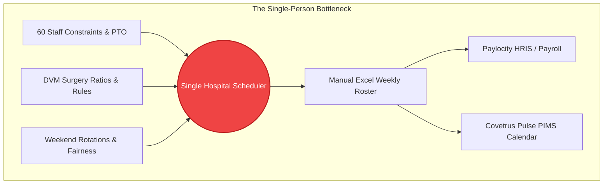

# Project Genesis & The WCAH Business Problem

> *"The business case that funds this is not 'scheduling is stressful.' It is: if she quits, gets sick, or takes a real vacation, the hospital cannot produce a schedule."*

---

## 🏥 The Clinical Setting: WCAH Linda Vista

West Coast Animal Hospital (Linda Vista location) operates a large, fast-paced multi-doctor veterinary medical practice. The hospital employs approximately **60 clinical and administrative staff members**, categorized into distinct, credential-governed tiers:

1. **Doctors of Veterinary Medicine (DVMs)**: Licensed veterinarians managing surgery, appointments, diagnostics, and urgent walk-in care.
2. **Registered Veterinary Technicians (RVTs)**: Licensed credentialed technicians authorized for anesthesia induction, controlled drug handling, surgical assistance, and critical nursing.
3. **Veterinary Assistants (VAs)**: Clinical support staff assisting doctors, holding patients, running lab work, and managing treatment rooms.
4. **Hospital Support Staff (HSS) / Client Care (CSR)**: Front desk, client intake, emergency triage coordination, and phone triage.
5. **Pharmacy Technicians & Administrative Staff**: Inventory, prescription dispensing, and clinical management.

---

## 🛑 The Core Problem: The Single-Person Bus-Factor Bottleneck

Scheduling in a veterinary hospital is not simply placing blocks on a calendar. It is a multi-dimensional constraint puzzle where an invalid schedule leads to cancelled surgeries, legal compliance violations (e.g. DVM-to-RVT mandatory ratios), nurse burnout, and clinical downtime.

At WCAH, the entire hospital schedule was constructed by **one person**:
- **Blank Sheet Fallacy**: Every week, she reportedly started from a blank spreadsheet with no fixed templates or rigid shifts.
- **Tacit, Unwritten Rules**: The rules that made a schedule "good" or "illegal" existed solely inside her memory. They had never been written down or formalized in software.
- **Immense Cognitive Load**: Balancing 60 individual availability constraints, time-off requests, DVM-to-VA ratios, weekend rotation fairness, interpersonal synergies, and overtime limits required days of manual spreadsheet manipulation.
- **The Existential Risk**: If this single individual were unable to work, the hospital lacked any system or procedure to generate an operational schedule.

---

## 🎯 The Vision: An AI-Native Shift Scheduling System

Rather than attempting to train another human to memorize unwritten rules, leadership established a mandate: **Build an AI-native Operations Management System that externalizes tacit clinical expertise into a deterministic, inspectable, and resilient rule engine.**

### Core Objectives:
1. **Externalize the Tacit Rulebook**: Pull the hidden constraints out of human memory and represent them as readable, editable software rules.
2. **AI-Native Interface with Human Co-Pilot**: Allow administrators to paste raw text, drop shift requests, or ask natural language queries, with the AI extracting structured constraints into a relational database.
3. **Multi-System Bridge**: Unify data across the hospital's existing SaaS landscape:
   - **Paylocity**: HRIS containing official rosters, approved PTO, time cards, and payroll.
   - **Covetrus Pulse**: Practice Information Management System (PIMS) driving appointment demand and clinical room assignments.
   - **WhenIWork**: Doctor shift management.
4. **Robustness-First Allocation**: Optimize not for brittle theoretical perfection, but for **recoverability**—ensuring the hospital can absorb staff call-outs without operational collapse.

---

## 🗺️ Phased Rollout Strategy

To deliver immediate value and iteratively capture the domain model, the project adopted a 7-phase implementation roadmap:

| Phase | Milestone | Focus |
| :---: | :--- | :--- |
| **Phase 1** | **Manual Data Ingestion & Rule Engine** | Manual copy/paste & AI prompt extraction; roster definitions; DVM daily counts; weekend rotation engine; overtime minimization; local UI. |
| **Phase 2** | **Named DVM Rosters & Synergies** | Naming specific doctors; VA-to-DVM synergy matrices (-10 to +10 ranking); interpersonal pairing constraints. |
| **Phase 3** | **Paylocity Ingestion** | Automated ingestion of approved time-off requests and employee master rosters. |
| **Phase 4** | **Paylocity Schedule Publishing** | Direct automated export of finalized, approved weekly schedules into Paylocity. |
| **Phase 5** | **WhenIWork DVM Ingestion** | Pulling doctor schedules directly from WhenIWork to anchor daily technician demand. |
| **Phase 6** | **DVM Scheduling Engine** | Algorithmic generation of veterinarian scheduling based on clinical appointment demand. |
| **Phase 7** | **WhenIWork Publishing** | Bi-directional synchronization of doctor schedules back into WhenIWork. |

---

## 🔑 Key Strategic Takeaway

The early insight that guided every phase of development was clear: **The solver is only a component; the rulebook is the product.** By focusing on rule capture first, WCAH eliminated the single-person dependency and laid the foundation for an enterprise-grade Operations Management System.
