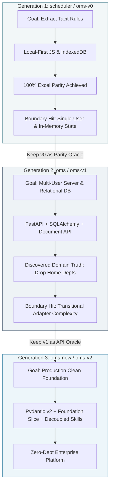

# Architectural Essay: The "Greenfield Next to Brownfield" Iterative Model

> *An analytical evaluation of why each repository iteration (`scheduler` → `oms` → `oms-new`) was transitioned, and why a hybrid greenfield-next-to-brownfield lifecycle proved to be an extraordinary development accelerator.*

---

## 🏛️ The Central Question

Across a 4-week sprint cycle, the WCAH OMS platform transitioned through three distinct repository codebases:
1. **`scheduler` (`oms-v0`)**: Local-first React single-page app and pure JavaScript rule engine.
2. **`oms` (`oms-v1`)**: Client-server monolith with FastAPI backend, SQLite/PostgreSQL, and Excel Document API pipelines.
3. **`oms-new` (`oms-v2`)**: Clean-slate Foundation Slice architecture with decoupled domain models and strict typing.

A conventional software engineering critique might ask:
> *"Why not build everything in a single repository with continuous refactoring? Was restarting across new repositories a symptom of churn, or was it a deliberate accelerator?"*

The evidence demonstrates conclusively that this **"greenfield next to brownfield"** pattern was not accidental churn—it was a **high-leverage strategic accelerator** uniquely suited for complex, domain-heavy healthcare engineering.

---

## ⚡ Why Repositories Were Transitioned

### 1. The Transition from `scheduler` (`oms-v0`) to `oms` (`oms-v1`)
* **Why it was started**: `oms-v0` was designed for pure velocity in rule discovery. It needed zero backend friction so algorithms could be tested against messy clinical spreadsheets in minutes.
* **Why it hit its boundary**: Once all 10+ rule templates were proven, `oms-v0` hit its structural limit: it was a local-first browser application storing state in IndexedDB. It could not provide multi-user authentication, ACID transactions, or direct Paylocity/PIMS API endpoints.
* **Why it was not rewritten in-place**: Modifying a working client-side prototype in-place while introducing server infrastructure risks breaking the delicate, proven algorithmic rules. Keeping `oms-v0` frozen as a **living benchmark oracle** allowed the team to verify the new Python backend against a known working standard.

### 2. The Transition from `oms` (`oms-v1`) to `oms-new` (`oms-v2`)
* **Why it was started**: `oms-v1` successfully proved that FastAPI and PostgreSQL could handle the relational schema and document export/import pipelines.
* **Why it hit its boundary**: During the rapid exploration of `oms-v1`, major domain breakthroughs occurred (e.g., discovering that rigid "home departments" were a clinical anti-pattern and that shift durations required dynamic intervals). Implementing these discoveries inside `oms-v1` left a trail of transitional adapter code, backward-compatibility shims, and legacy Excel quirks.
* **Why it was transitioned to `oms-new`**: With the true domain model fully understood, starting `oms-new` allowed the team to write clean, canonical Pydantic v2 schemas and modular package structures without dragging legacy scaffolding along.

---

## 🚀 Why "Greenfield Next to Brownfield" was an Accelerator

### 1. Bypassing the "Second System Effect"
When engineering teams attempt to build the "ultimate production architecture" on Day 1, they inevitably over-engineer abstractions for problems they do not yet understand. 
By using `oms-v0` as a disposable exploratory wedge, WCAH extracted the entire tacit rulebook in under two weeks without wasting time configuring Kubernetes, SSO, or migration frameworks.

### 2. Living Brownfield Oracles as Test Oracles
In traditional rewrites, developers guess how the old system worked. In our model:
- `oms-v0` served as the **test oracle for algorithmic correctness**. If `oms-v1` produced a different shift assignment than `oms-v0`, the discrepancy was immediately caught.
- `oms-v1` served as the **test oracle for API contracts and Excel serialization**.
- `oms-new` inherited verified schemas without needing to rediscover clinical edge cases.

### 3. Freedom to Discard Accidental Complexity
As software evolves, it accumulates accidental complexity—code written to bridge temporary misunderstandings. In a single-repo refactor, teams spend 70% of their time writing migrations and shims. By spinning up clean-slate iterations, the engineering team simply discarded the accidental complexity while retaining the essential domain logic.

### 4. Zero Loss of Institutional Memory (The Pagenary Multi-Tenant Solution)
The primary danger of multi-repo development is knowledge fragmentation: old specs and decisions get lost in abandoned Git histories.
By establishing the **`wcah-docs-library`** powered by Pagenary:
- Every specification, decision record, implementation plan, and SDD task report from `oms-v0`, `oms-v1`, and `oms-v2` is preserved in full fidelity.
- Each tenant maintains its own searchable archive.
- The anchor tenant (`wcah`) provides unified global context, timeline traceability, and architectural continuity.

---

## 🏆 Conclusion

The "greenfield next to brownfield" iterative strategy was an **outstanding success**. It delivered:
1. **Speed of Rule Discovery** (unlocked by `oms-v0`).
2. **Speed of Enterprise Validation** (unlocked by `oms-v1`).
3. **Pristine Production Architecture** (unlocked by `oms-v2`).
4. **Complete Historical Traceability** (unlocked by `wcah-docs-library`).
