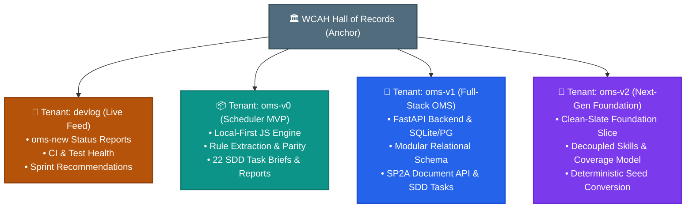

# WCAH: OMS Hall of Records

> **West Coast Animal Hospital — Operations Management System (OMS)**  
> *Permanent Architectural Archive, Project Genesis, Cross-Generational Timeline, and Technical Retrospective.*

---

> ### 📡 Live Project Feed — [Open the Devlog tenant →](/devlog/)
>
> Ongoing status reports for the active **[oms-new](https://github.com/TomWCAH/oms-new)** repository (OMS v2) are published in the **[Devlog](/devlog/)**: latest changes, CI health, documentation drift, and next-sprint recommendations. Start with the [2026-08-19 repository report (3rd pass)](/devlog/#repo-status-2026-08-19-3).

---

## 🏛️ Executive Welcome

Welcome to the **WCAH OMS Hall of Records**. This portal is the primary anchor of the West Coast Animal Hospital documentation ecosystem. It chronicles the journey of engineering an **AI-native, constraint-driven Operations Management System** to solve one of the most critical operational challenges in modern veterinary medicine: **clinical shift scheduling, skill-matched staffing, and enterprise resource planning**.

Here you will find the original business genesis, foundational specifications, architectural transformation blueprints, a comprehensive multi-repo timeline, and an in-depth retrospective analyzing our **"greenfield next to brownfield"** iterative development strategy.

---

## 🧭 Hall of Records Navigation

### 1. [Genesis & Business Problem](#genesis-and-business-problem)
Explore the origin of the project: the ~60 employee staffing puzzle at WCAH Linda Vista, the single-person bus-factor bottleneck, tacit rules, and why off-the-shelf software failed.

### 2. [Scheduling Epic Specification](#scheduling-epic-spec)
The foundational prototyping brief defining why straight mathematical optimization fails, cross-industry mechanisms stolen from aviation PBS and Wharton Course Match, assumptions challenged, and the 3-layer architecture.

### 3. [12-Factor Production Architecture](#architecture-12factor-plan)
The enterprise transformation roadmap aligning the platform with the 12-Factor App methodology: FastAPI, async SQLAlchemy, PostgreSQL, Redis, Microsoft Entra ID (O365) SSO, and containerization.

### 4. [Evolution Timeline](#evolution-timeline)
A comprehensive chronological timeline from July 2026 through August 2026 mapping every sprint milestone, design decision, and technical pivot across all three repository generations.

### 5. [Approaches & Technology Stack](#approaches-and-technology)
A comparative deep dive into the architectures, programming languages, state managers, persistence layers, and testing frameworks used in each generation.

### 6. [Challenges Met & Lessons Learned](#challenges-and-lessons)
Detailed post-mortems on tacit knowledge extraction, Excel benchmark parity, home department decoupling, frontend/backend schema drift, and robustness-first scheduling.

### 7. [Greenfield vs. Brownfield Iterative Analysis](#greenfield-vs-brownfield-analysis)
An architectural essay examining why each repository iteration was transitioned, proving why "greenfield next to brownfield" served as a dramatic development accelerator rather than wasteful churn.

---

## 🔗 Direct Links to Sub-Tenant Archives

| Tenant Repository | Title & Focus | Documents | Primary Innovations | Link |
| :--- | :--- | :---: | :--- | :---: |
| **`devlog`** | **Live Feed (oms-new)** | **Rolling** | Ongoing status reports for the active `oms-new` repository: latest changes, CI health, doc drift, sprint recommendations. | [Browse `devlog` →](/devlog/) |
| **`oms-v0`** | **Scheduler MVP** | **64 Docs** | Local-first prototype, pure JS domain rules, Excel parity benchmark, 22 SDD task briefs & reports. | [Browse `oms-v0` →](/oms-v0/) |
| **`oms-v1`** | **Full-Stack OMS** | **60 Docs** | Python FastAPI backend, React frontend, modular database schema, conformance testing, SP2A Document API. | [Browse `oms-v1` →](/oms-v1/) |
| **`oms-v2`** | **Next-Gen OMS (`oms-new`)** | **44 Docs** | Greenfield foundation slice, decoupled skill profiles, practice shift lengths, deterministic seed conversion. | [Browse `oms-v2` →](/oms-v2/) |

---

## ⚡ Global Search & Command Palette

Press **⌘K** (or **Ctrl+K**) anywhere to instantly search across all historical records, architectural decisions, and domain models.
